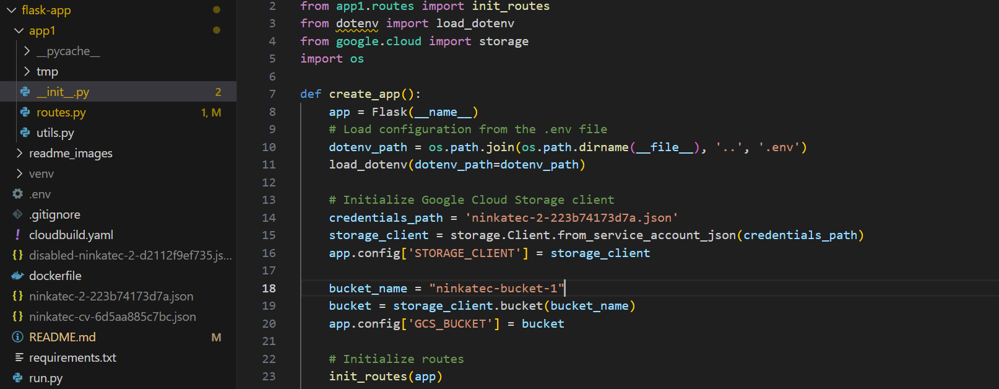
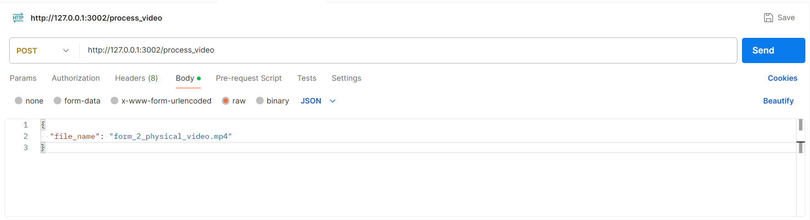

# CV Flask App

This is a Flask application designed for processing videos using OpenCV and Google Cloud Storage (GCS). The app is used as a microservice to the ruby-app and provides a route to process videos which will output a preliminary AI assesment of the video.

## Features

- **Home Route:** Simple route to confirm the app is running.
- **Process Video:** A route that handles POST request containing a file name. The flask microservice will retrieve the appropriate file with that fill name from GCS, process it using OpenCV, and upload the processed video back to GCS and output the assessment as a response.

For debugging (can be removed):
- **Serve Video:** Serve video files directly from GCS (Test that your GCS is connected).
- **List Files:** List all files in a specified directory (Shows what files were uploaded onto cloud).
- **FFmpeg Codecs:** Display the available FFmpeg codecs.
- **Create Video:** This route tests the writing of a blackscreen video to ensure the videowriter works with the appropriate codec

## Prerequisites

Before running the app, ensure you have the following:

- Python 3.12.3
- `virtualenv` for creating a virtual environment (pip install virtualenv)
- Google Cloud Bucket

## Python Packages

We should install these in the virtual environment using requirements.txt.

- **Flask**
  - A micro web framework for Python used to create web applications.

- **mediapipe** 
  - A library for building cross-platform, customizable ML solutions for live and streaming media.

- **google-cloud-storage** 
  - Client library for Google Cloud Storage, used for interacting with Google Cloud buckets.

- **python-dotenv** 
  - A tool for loading environment variables from a `.env` file into the Python environment.

- **numpy**
  - A fundamental package for scientific computing with Python, providing support for large, multi-dimensional arrays and matrices.

- **waitress** 
  - A production-quality pure-Python WSGI server for running Python web applications.

- **imageio[ffmpeg]** 
  - A library for reading and writing image data in various formats, with optional support for video processing via FFmpeg.

## Setup Instructions

### 1. Clone the Repository

```bash
git clone https://github.com/Service-Design-Studio/1d-final-project-summer-2024-sds-2024-team-05.git
cd flask-app
```

### 2. Set up Google Cloud Bucket in the Main ReadMe

This flask app is designed to retrieve and upload files directly to Google Cloud Bucket,  hence you will need a Google Cloud Bucket and a JSON key credentials for this to work locally as well.

For example: setting up a testing bucket in another project (not deploying, because deployment should use the same bucket as the ruby-app)

    1. Create a project on Google Cloud 
    2. Go to Cloud Storage and create a bucket
    3. Go to IAM & Admin > Service Account > Create a key
    4. Insert the bucket name and key into you project and put the key under .gitignore

End product will look like this:

The different keys are for different service accounts with access to different buckets. For example, ninkatec-2.json leads to the production bucket whereas ninkatec-cv.json was just used for our own testing with postman.

### 3. Running flask locally

```bash
#create a new directory named venv containing the virtual environment
python3 -m venv venv

#activating the virtual environment
.\venv\Scripts\activate

#install the required packages within your virtual environment
pip install -r requirements.txt

#run the flask app in the virtual environment
python run.py
```

### 3. Test using postman

If the flask app is running, upload a video directly onto Google Cloud Bucket, and use **Postman** to test the API endpoint. Refer to the API Ref below 

### API Reference

#### Process uploaded video

```http
  POST /process_video
```

| Parameter | Type     | Description                |
| :-------- | :------- | :------------------------- |
| `file_name` | `string` | **Required**. The name of the file stored on Google Cloud Bucket (eg. form_2_physical_video.mp4) |



## Deployment FYI

We had some difficulty using OpenCV on the Cloud Linux container so we installed Miniconda within the cloud container itself in the Dockerfile.

Ensure to change the following before doing a gcloud builds submit to your **respective project**:
```bash
#cloudbuild.yaml
_SERVICE_NAME:
_REGION

#__init.py
credentials_path
bucket_name
```

With that, everything should work 🙂
