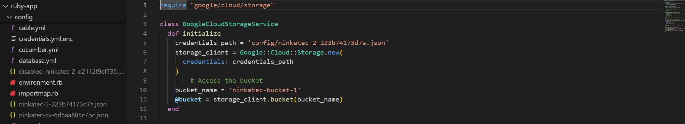
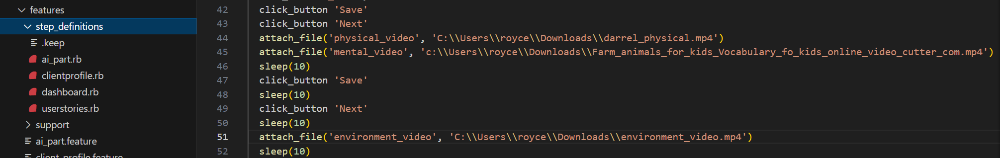

# Ruby Application

This README provides the necessary steps to get the Ruby on Rails application up and running.

## Ruby Version
- **Ruby**: `3.3.2`

## System Dependencies

### Ruby Gems
- **Rails (`7.1.3.4`)**  
  A web application framework for Ruby that provides default structures for a database, web services, and web pages.

- **Puma (`~> 5.0`)**  
  A high-performance web server designed for Ruby/Rails applications.

- **Devise (`~> 4.9.3`)**  
  A flexible authentication solution for Rails, supporting features like password recovery and account locking.

- **RSpec-Rails**  
  Testing tools specific to Rails, used for writing and running tests for Rails applications.

- **google-cloud-storage**  
  A client library for interacting with Google Cloud Storage, used for managing Google Cloud buckets.

### JavaScript Libraries
- **Stimulus-Rails**  
  A lightweight JavaScript framework for enhancing the behavior of HTML within your application.

- **Turbo-Rails**  
  A framework for building modern, fast, and reliable web applications by leveraging techniques like partial page updates.

### Database
This application uses different databases based on the environment:

- **PostgreSQL (Production)**  
  A powerful, open-source relational database management system used in production for managing application data. It supports complex queries and ensures data integrity.

- **SQLite3 (Development/Testing)**  
  A lightweight, file-based relational database included with Ruby on Rails by default for development and testing environments. It is simple to set up and ideal for local development.

## Application Controllers

### PatientsController
- Handles the CRUD (Create, Read, Update, Delete) operations for patient application forms. This controller manages the lifecycle of patient data within the application.

### AdminsController
- Manages the functionalities of the admin dashboard, client profile pages, and patient assessments. This controller is responsible for overseeing the administrative aspects of the application.

### MeetingsController
- Responsible for handling the CRUD operations related to meetings. This controller facilitates the scheduling, updating, and management of meetings within the application.

## Application Models

### Form
- Contains all the data related to the patient that is filled out in the application form

### Meeting
- Contains the data related to the meeting such as title, description, location, start time

### User
- Contains all the user data such as email, password, first name, last name and whether the user is an admin

## Setup and info

- **Configuration**  
  The application configuration can be managed through environment files or the Rails `config` directory. Ensure that all necessary environment variables are set up correctly.
  
  **Automated Email Function** can be configured in ```config/environments/development.rb and production.rb

This app is designed to retrieve and upload files directly to Google Cloud Bucket,  hence you will need a Google Cloud Bucket and a JSON key credentials for this to work locally as well.

For example: setting up a testing bucket in another project (not yet deploying, because deployment should use the same bucket as the ruby-app)

    1. Create a project on Google Cloud 
    2. Go to Cloud Storage and create a bucket
    3. Go to IAM & Admin > Service Account > Create a key
    4. Insert the bucket name and key into you project and put the key under .gitignore

End product will look like this:

The different keys are for different service accounts with access to different buckets. For example, ninkatec-2.json leads to the production bucket whereas ninkatec-cv.json was just used for our own testing with postman. Add the path to the key under `app/services/GoogleCloudStorageService`

- **Install the Gems required**  
  run the following command:
  ```bash
  bundle install
  ```

- **Database Creation**  
To create the database, run the following command:
```bash
rails db:create
rails db:migrate
rails db:seed
```

The admin user is seeded in the database

- **Run the rails server**  
To create the database, run the following command:
```bash
rails s
```

## Testing

We mainly did testing in rspec and cucumber. 

Our rspec unit tests were written to test the functionality of individual methods of our controllers and models and our system tests were written in rspec and capybara. These can be found under  `spec/`.

For our cucumber tests, we wrote user scenarios in cucumber and executed it using selenium. They can be found under `features/`.

### Executing the tests
For the following steps, you should be in the ruby-app directory

- **Database Creation**  
  To create the database, run the following command:
  ```bash
  rails db:create RAILS_ENV=test
  rails db:migrate RAILS_ENV=test
  rails db:seed RAILS_ENV=test
  ```

  To purge the database, run the following command:
  ```bash
  #purge test database
  rails db:purge RAILS_ENV=test

  #purge development database
  rails db:purge
  ```
  After purging, do the creation steps again to start on a clean slate.

- **Execute rspec**  
  To execute rspec, run the following command:
  ```bash
  rspec
  ```

- **Execute cucumber**  
  Before you execute this, you will need to change the following paths and please clear the test and development database if required

  Replace all the video file paths in ai_part.rb, client_profile.rb, dashboard.rb, userstories.rb
  

  Replace all the pdf file paths in ai_part.rb, client_profile.rb, dashboard.rb, userstories.rb
  

  To execute the cucumber tests, run the following command:
  ```bash
  bundle exec cucumber
  ```
